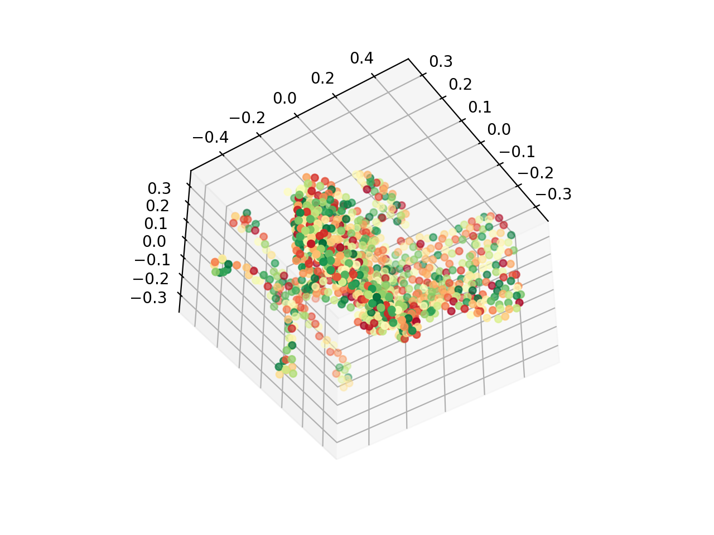
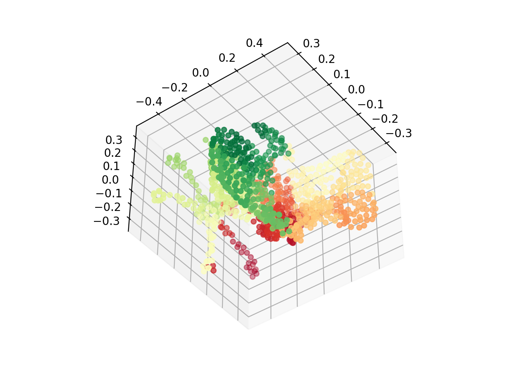
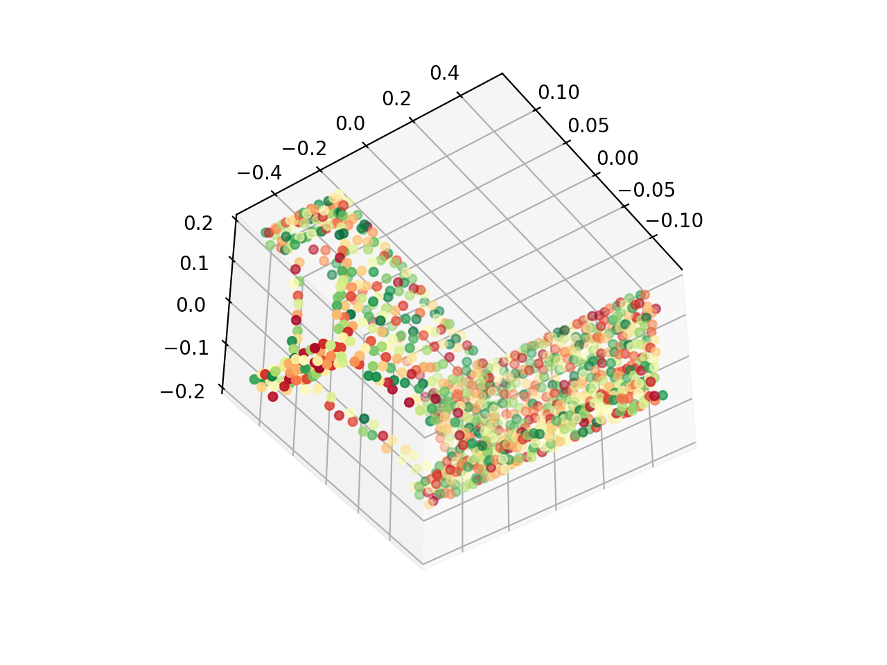
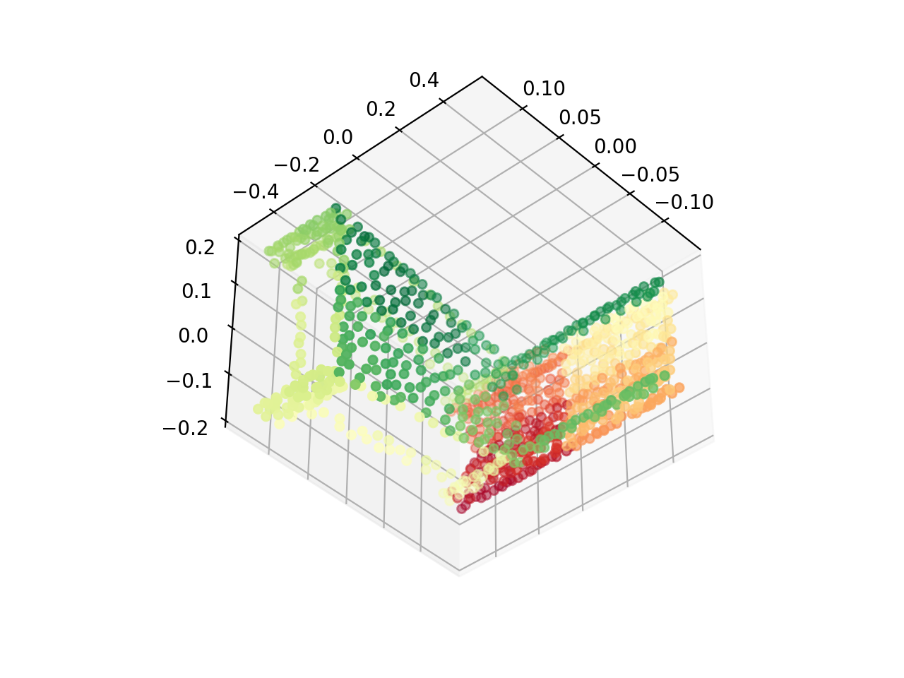
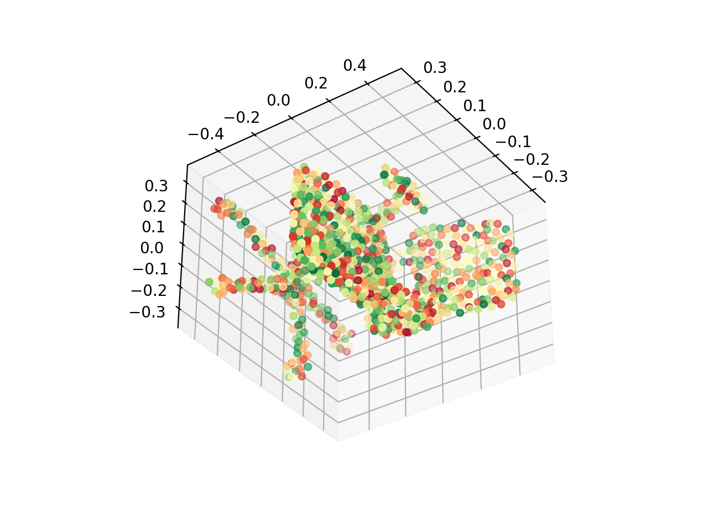
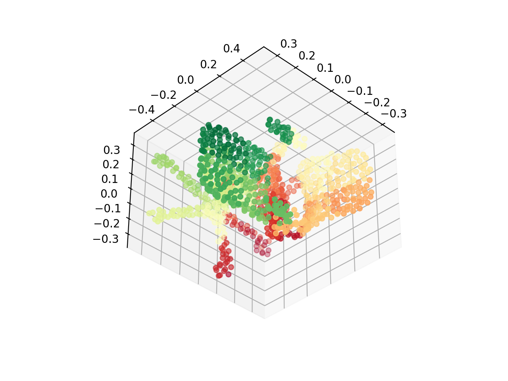
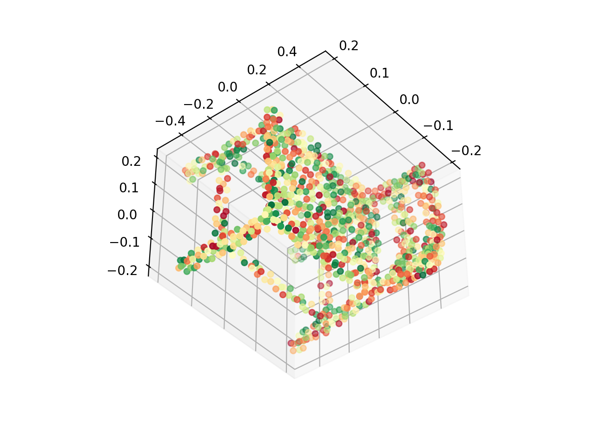
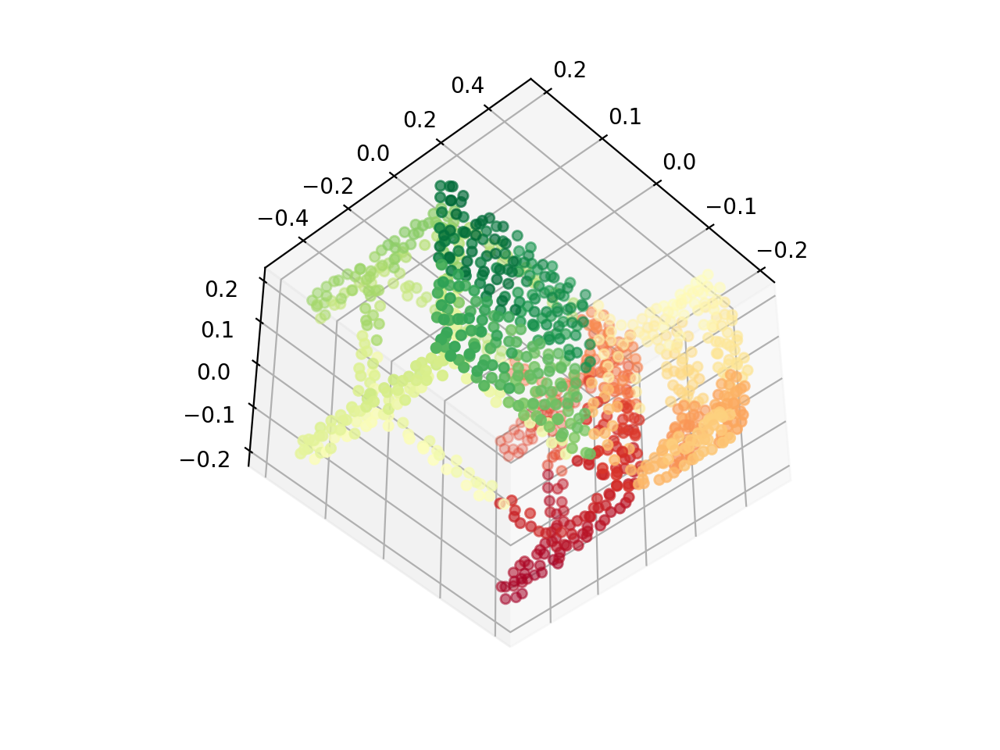
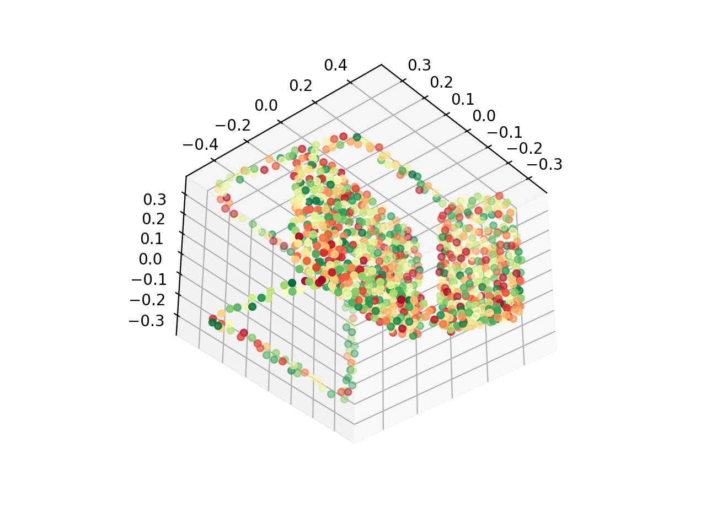
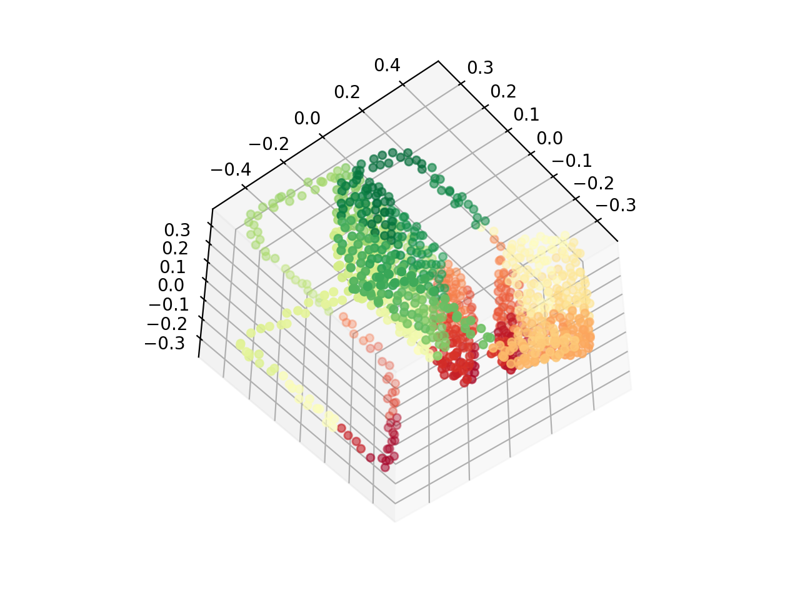

# Shape Generation Using Spatially Partitioned Point Clouds 

This repository implements the following utilities:

1. Spatially partitioned point cloud
2. PCA
3. Iterative Point Ordering
4. GAN

## Various methods used in the work

### Poisson Disc Sampling


### K Dimensional Tree

Binary search tree in which data in each node is a K-dimensional point in space. 

Building a K-d tree for 3D Data: 

1. Select the initial axis and sort the data according to it, and insert median of that data as the root. 
2. Select next axis based on the increasing depth, as axis = d%k. 
3. Sort the points by the obtained axis and choose median as pivot element, is less then left branch or right branch. 
4. Traverse the tree until all the data points are not inserted. 

Some examples of obtained color map before and after sorting the point clouds:

Before KdTree              |  After KdTree
:-------------------------:|:-------------------------:
   |  
   |  
   |  
   |  
   |  


### Principal Component Analysis

Principal Component Analysis (PCA) is a method to for dimensionality reduction of a dataset and to speed up the applied algorithm.

In this case, we apply PCA on the sorted point cloud by generating a matrix of size 3N x S, where N is number of points in each shape and S is the number of shapes in the dataset. And then perform PCA on the matrix: P = UΣV, resulting in the linear shape basis U and projections V. By default, the size of shape basis is chosen to be B = 100. 

### Learning Shape Coefficients Using GAN

## Requirements

```bash
pip3 install -r requirements.txt
```

## Usage

```bash
python3 main.py [--mode MODE] [--load_path PATH]
                [--save_path PATH] 
```

## References

- sklearn.decomposition.PCA [Link](https://scikit-learn.org/stable/modules/generated/sklearn.decomposition.PCA.html)
- Vanilla GAN [Link](https://github.com/safwankdb/Vanilla-GAN)